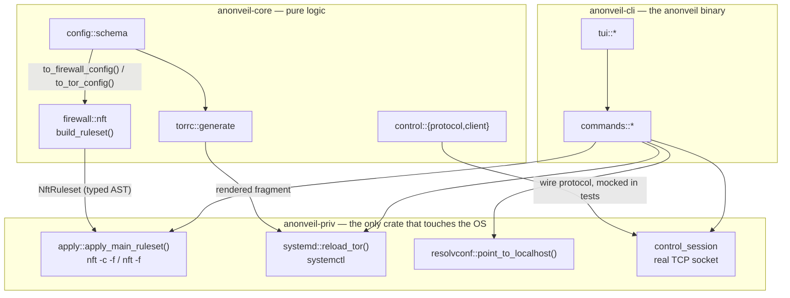
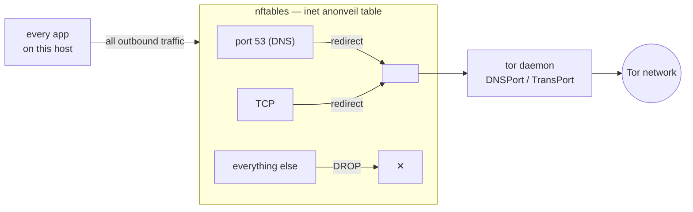

# Architecture

## Three crates, split strictly by privilege

No root, no I/O side effects in `anonveil-core` — every function that
matters (`build_ruleset`, `build_torrc_fragment`, the control-port wire
protocol) is pure and unit-tested with plain inputs and outputs, no
privileges required. `anonveil-priv` is the *only* crate that shells out
to `nft`/`systemctl`/`ip`, writes to `/etc`/`/var/lib/anonveil`, or opens
the real control-port socket — and it only ever executes what `core`
already decided, never constructs a rule itself. `anonveil-cli` wires
both together into the `anonveil` binary's subcommands and the TUI.

## The kill switch itself

One isolated `inet anonveil` table, built by
[`crates/anonveil-core/src/firewall/nft.rs`](https://github.com/Gerijacki/anonveil/blob/main/crates/anonveil-core/src/firewall/nft.rs) —
read that file's module doc before touching it; it *is* the security
model, and every design decision in it (why `output`-hook only, why DNS
has no local-subnet exemption, why IPv6 is hard-blocked, why
`excluded_interfaces` can't affect the NAT redirect) is explained inline,
not just implemented. `anonveil audit-ruleset` prints the exact rendered
script for your current config, so you never have to take this diagram's
word for it.

## Why nftables, not iptables

Both Arch's `iptables` package and Debian's default backend are
nftables-based today. AnonVeil targets nftables directly: one atomic,
isolated table that's trivial to add (`start`) and remove (`stop`)
cleanly, instead of juggling `iptables`/`ip6tables`/`iptables-legacy`
fragmentation, or risking interference with rules a host might already
have from something else.

## Why the Tor control-port client is first-party

See [`crates/anonveil-core/src/control/mod.rs`](https://github.com/Gerijacki/anonveil/blob/main/crates/anonveil-core/src/control/mod.rs):
the two existing crates for this (`torut`, `stem-rs`) were unmaintained
or too new/unvetted for a security-critical dependency, so AnonVeil
implements the control-spec.txt line protocol itself — a small, first-
party, `#[cfg(test)]`-covered client, generic over its transport
(`tokio::io::duplex` in tests, a real `TcpStream` in `anonveil-priv`) so
the wire protocol is exercised with no root and no real socket needed.
